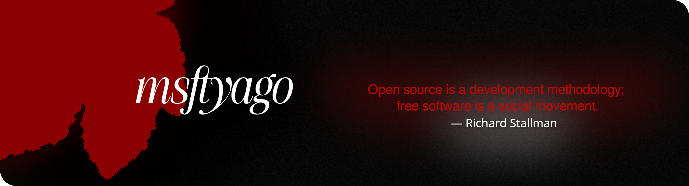

<!-- <p> -->
<!--     <a href="https://github.com/msftyago/msftyago/readme.md"> -->
<!--         <picture> -->
<!--         <source srcset="./assets/b.png"> -->
<!--          -->
<!--         </picture> -->
<!--     </a> -->
    
<!-- </p> -->

<!-- <p align="center"> -->
<!--     <samp> -->
<!-- 	<a href="https://meow.uz">meow.uz</a> . -->
<!-- 	<a href="mailto:meow@meow.uz">e-mail</a> . -->
<!-- 	<a href="https://github.com/msftyago/msftyago/tree/main/CV">CV</a> . -->
<!-- 	<a href="https://bandcamp.com/msftyago">bandcamp</a> . -->
<!--     <a href="https://leetcode.com/u/msftyago/">leetcode</a> . -->
<!--     <a href="https://www.telegram.org/msftyago">contact</a> -->
<!--     </samp> -->
<!-- </p> -->

$${\color{black}Dying\space Fox\space Mountain\space Witch}$$

<big><pre>
Fan of GPL-3.0, Emacs enjoyer, Network wizard, 18
|    **Current stack:** Rust & Nix
|    **Specialties:** NetOps, DevOps, Software Engineering, hardware maintainance
|    **Daily drive:** NixOS & [Xinux](https://xinux.uz)
|    **Editor of choice:** GNU Emacs ([config](https://github.com/msftyago/nix))
|    **CV:** [PDF](https://github.com/msftyago/msftyago/tree/main/CV) compiled from LaTeX
|    **Interested in:** FP, circuitry, LISP, graphics programming
|    **Distractions:** Photography, cycling & running, music (preferrably metal, alt, or shoegaze)
|	 **Studying:** Calculus, FP, CCNA
| more at [meow.uz](https://meow.uz)
| mail me at [meow@meow.uz](mailto:meow@meow.uz)
</pre></big>

<!-- ## $${\color{red}stack}$$ -->

<!-- ``` json -->
<!-- | Network       | Systems                            | Programming   | Framework & APIs | IoT     | Debugging & pentesting tools | Software                 | Documenting & Media        | -->
<!-- |---------------+------------------------------------+---------------+------------------+---------+------------------------------+--------------------------+----------------------------| -->
<!-- | cisco 200-301 | NixOS, Guix                        | C/C++         | OpenGL           | ESP-32  | Strace                       | KiCAD                    | TeX, LaTeX, PDF, EPUB      | -->
<!-- | mikrotik      | Live operating systems, Ventoy     | Nix           | Qt               | STM     | OpenTelemetry                | OpenSCAD                 | Emacs Org                  | -->
<!-- | palo alto     | RTOS                               | Rust          | Django           | Arduino | Wireshark                    | GNU Gimp                 | typst                      | -->
<!-- | huawei        | Debian based distributions         | Clojure/Elisp | Aiogram          | RTOS    | tcpdump                      | Blender 3D               | XML, JSON, Toml            | -->
<!-- | VNC           | RHEL                               | Python        | Flask            |         | eve-ng                       | Da Vinci Resolve         | HTML, Markdown             | -->
<!-- | Torrent       | FreeBSD, NetBSD, OpenBSD, NixBSD   | Ruby          | tokio            |         | nmap                         | Putty, MobaXterm, WinSCP | LibreOffice, 360           | -->
<!-- | Cloudflare    | Gentoo, operating systems assembly | Lua           | Numpy            |         | HWiNFO                       |                          | DNG, ARW, RAW, LOG         | -->
<!-- |               | Kubernetes                         |               | ESP-IDF          |         | hashcat                      |                          | Excalidraw, draw.io, figma | -->
<!-- |               | Docker, Nix, npm                   |               | ffmpeg           |         |                              |                          | DaVinci Resolve            | -->
<!-- |               | Oracle VM, Wine, Bottles, VMWare   |               | sockets          |         |                              |                          | Capture One                | -->
<!-- |               | SystemD, Initrd, GRUB              |               |                  |         |                              |                          | Adobe Lr, Ps, Pr, Ai       | -->
<!-- |               |                                    |               |                  |         |                              |                          |                            | -->
<!-- ``` -->
